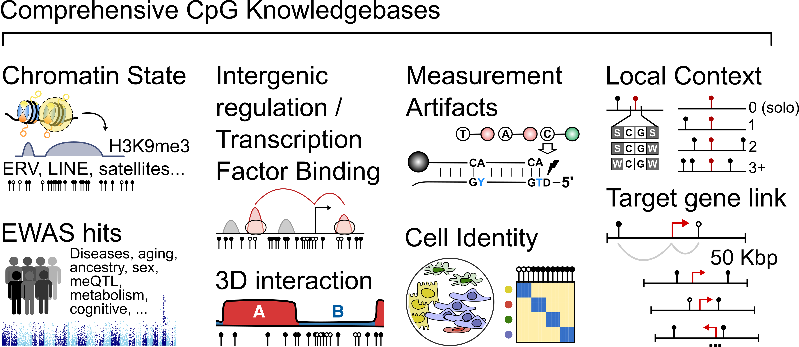

KnowYourCG (KYCG) is a supervised learning framework designed for the functional 
analysis of DNA methylation data. Unlike existing tools that focus on genes or 
genomic intervals, KnowYourCG directly targets CpG dinucleotides, featuring 
automated supervised screenings of diverse biological and technical influences, 
including sequence motifs, transcription factor binding, histone modifications, 
replication timing, cell-type-specific methylation, and trait associations. 
KnowYourCG addresses the challenges of data sparsity in various methylation 
datasets, including low-pass Nanopore sequencing, single-cell DNA methylomes, 
5-hydroxymethylation profiles, spatial DNA methylation maps, and array-based 
datasets for epigenome-wide association studies and epigenetic clocks.

The input to KYCG is a CpG set (query). The CpG sets can represent differential
methylation, results from an epigenome-wide association studies, or any sets
that may be derived from analysis. If **array experiment**, the preferred
format of the query sets is a character vector of cg-numbers, following the
standard Infinium array naming nomenclature. 

# QUICK START

The following commands prepare the use of knowYourCG. Several database sets are
retrieved and caching is performed to enable faster access in future 
enrichment testing. More information on viewing and accessing available 
database sets is discussed later on.

```{r ky1, load-depenencies, results="hide", message=FALSE, warning=FALSE}
library(knowYourCG)
library(sesameData)
sesameDataCache(data_titles=c("genomeInfo.hg38","genomeInfo.mm10",
                  "KYCG.MM285.tissueSignature.20211211",
                  "MM285.tissueSignature","MM285.address",
                  "probeIDSignature","KYCG.MM285.designGroup.20210210",
                  "KYCG.MM285.chromHMM.20210210",
                  "KYCG.MM285.TFBSconsensus.20220116",
                  "KYCG.MM285.HMconsensus.20220116",
                  "KYCG.MM285.chromosome.mm10.20210630"
                  ))
```

The following example uses a query of CpGs methylated in mouse primordial germ 
cells (design group PGCMeth). First get the CG list using the following code.

```{r ky2, message=FALSE}
query <- getDBs("MM285.designGroup")[["PGCMeth"]]
head(query)
```

Now test the enrichment. By default, KYCG will select all
the categorical groups available but we can specify a subset of databases.

```{r ky3, fig.width=8, fig.height=5, message=FALSE}
dbs <- c("KYCG.MM285.chromHMM.20210210",
         "KYCG.HM450.TFBSconsensus.20211013",
         "KYCG.MM285.HMconsensus.20220116",
         "KYCG.MM285.tissueSignature.20211211",
         "KYCG.MM285.chromosome.mm10.20210630",
         "KYCG.MM285.designGroup.20210210")
results_pgc <- testEnrichment(query,databases = dbs,platform="MM285")
head(results_pgc)
```

As expected, the PGCMeth group itself appears on the top of the
list. But one can also find histone H3K9me3, chromHMM `Het` and transcription
factor `Trim28` binding enriched in this CG group.

# KNOWLEDGEBASES

The curated target features are called the knowledgebase sets. We have curated
a variety of knowledgebases that represent different categorical and continuous
methylation features such as CpGs associated with chromatin states, technical
artifacts, gene association and gene expression correlation, transcription
factor binding sites, tissue specific methylation, CpG density, etc.



The success of enrichment testing depends on the availability of
biologically-relevant databases. To reflect the biological meaning of databases
and facilitate selective testing, we have organized our database sets into
different groups. Each group contains one or multiple databases. Here is how to
find the names of pre-built database groups:

``` {r ky5, list-data, eval=TRUE, echo=TRUE}
listDBGroups("MM285")
```

The `listDBGroups()` function returns a data frame containing information
of these databases. The Title column is the accession key one needs for the
`testEnrichment` function.  With the accessions, one can either directly use
them in the `testEnrichment` function or explicitly call the
```getDBs()``` function to retrieve databases themselves. Caching these
databases on the local machine is important, for two reasons: it limits the
number of requests sent to the Bioconductor server, and secondly it limits the
amount of time the user needs to wait when re-downloading database sets. For
this reason, one should run ```sesameDataCache()``` before loading in any
database sets. This will take some time to download all of the database sets
but this only needs to be done once per installation.  During the analysis the
database sets can be identified using these accessions. knowYourCG also does 
some guessing when a unique substring is given. For example, the string
"MM285.designGroup" retrieves the "KYCG.MM285.designGroup.20210210"
database. Let's look at the database group which we had used as the query
(query and database are reciprocal) in our first example:

``` {r ky6, cache-data, eval=TRUE, warning=FALSE}
dbs <- getDBs("MM285.design")
```

In total, 32 datasets have been loaded for this group. We can get the "PGCMeth"
as an element of the list:

``` {r ky7, view-data1, eval=TRUE, warning=FALSE}
str(dbs[["PGCMeth"]])
```

On subsequent runs of the ```getDBs()``` function, the database loading
can be faster thanks to the sesameData [in-memory
caching](https://tinyurl.com/2wh9tyzk), if the corresponding database has been
loaded.

# ENRICHMENT TESTING

The main work horse function for testing enrichment of a categorical query 
against categorical databases is the `testEnrichment` function. This function 
will perform Fisher's exact testing of the query against each database set 
(one-tailed by default, but two-tailed optionally) and reports overlap and 
enrichment statistics. 

> **Choice of universe set:** Universe set is the set of all probes for a
given platform. It can either be passed in as an argument called
```universeSet``` or the platform name can be passed with argument
```platform```. If neither of these are supplied, the universe set will be
inferred from the probes in the query.

```{r ky10, run-test-single, echo=TRUE, eval=TRUE, message=FALSE}
library(SummarizedExperiment)

## prepare a query
df <- rowData(sesameDataGet('MM285.tissueSignature'))
query <- df$Probe_ID[df$branch == "fetal_brain" & df$type == "Hypo"]

results <- testEnrichment(query, "TFBS", platform="MM285")
results %>% dplyr::filter(overlap>10) %>% head

## prepare another query
query <- df$Probe_ID[df$branch == "fetal_liver" & df$type == "Hypo"]
results <- testEnrichment(query, "TFBS", platform="MM285")
results %>% dplyr::filter(overlap>10) %>%
    dplyr::select(dbname, estimate, test, FDR) %>% head
```

The output of each test contains multiple variables including: the estimate 
(fold enrichment), p-value, overlap statistics, type of test,
as well as the name of the database set and the database group. By default, 
the results are sorted by -log10 of the of p-value and the fold enrichment.

The ```nQ``` and ```nD``` columns identify the length of the query set and the
database set, respectively. Often, it's important to examine the extent of
overlap between the two sets, so that metric is reported as well in the
```overlap``` column.

A query set represents probes of interest. It may either be in the form of a
character vector where the values correspond to probe IDs or a named numeric
vector where the names correspond to probe IDs. The query and database
definition is rather arbitrary. One can regard a database as a query and turn a
query into a database, like in our first example. In real world scenario, query
can come from differential methylation testing, unsupervised clustering,
correlation with a phenotypic trait, and many others. For example, we could
consider CpGs that show tissue-specific methylation as the query. We are
getting the B-cell-specific hypomethylation.

```{r ky8, message=FALSE}
df <- rowData(sesameDataGet('MM285.tissueSignature'))
query <- df$Probe_ID[df$branch == "B_cell"]
head(query)
```

This query set represents hypomethylated probes in Mouse B-cells from the MM285
platform. This specific query set has 168 probes.

# GENE LINK & ENRICHMENT

A special case of set enrichment is to test whether CpGs are associated with
specific genes. Automating the enrichment test process only works when the
number of database sets is small. This is important when targeting all genes as
there are tens of thousands of genes on each platform. By testing only those
genes that overlap with the query set, we can greatly reduce the number of
tests. For this reason, the gene enrichment analysis is a special case of these
enrichment tests. We can perform this analysis using the
```buildGeneDBs()``` function.

```{r ky16, fig.width=7, fig.height=6, echo=TRUE, warning=FALSE, message=FALSE}
library(knowYourCG)
library(sesameData)
library(SummarizedExperiment)
query <- names(sesameData_getProbesByGene("Dnmt3a", "MM285"))
results <- testEnrichment(query, 
    buildGeneDBs(query, max_distance=100000, platform="MM285"),
    platform="MM285")
main_stats <- c("dbname","estimate","gene_name","FDR", "nQ", "nD", "overlap")
results[,main_stats]
```

As expected, we recover our targeted gene (Dnmt3a).

Gene enrichment testing can easily be included with default or
user specified database sets by setting include_genes=TRUE:

```{r ky28, warning=FALSE, message=FALSE, fig.width=5, fig.height=4}
query <- names(sesameData_getProbesByGene("Dnmt3a", "MM285"))
dbs <- c("KYCG.MM285.chromHMM.20210210","KYCG.HM450.TFBSconsensus.20211013",
         "KYCG.MM285.chromosome.mm10.20210630")
results <- testEnrichment(query,databases=dbs,
                          platform="MM285",include_genes=TRUE)
main_stats <- c("dbname","estimate","gene_name","FDR", "nQ", "nD", "overlap")
results[,main_stats] %>% 
    head()
```

One can get all the genes associated with a probe set and test the 
Gene Ontology of the probe-associated genes using the ```testGO()``` function, 
which internally utilizes [g:Profiler2](https://biit.cs.ut.ee/gprofiler/gost) 
for the enrichment analysis: 

```{r ky18, message=FALSE}
library(gprofiler2)
df <- rowData(sesameDataGet('MM285.tissueSignature'))
query <- df$Probe_ID[df$branch == "fetal_liver" & df$type == "Hypo"]
res <- testGO(query, platform="MM285",organism = "mmusculus")
head(res$result)
```


# GENOMIC PROXIMITY

Sometimes it may be of interest whether a query set of probes share close 
genomic proximity. Co-localization may suggest co-regulation or co-occupancy 
in the same regulatory element. KYCG can test for genomic proximity using 
the ```testProbeProximity()```function. Poisson statistics for the expected # 
of co-localized hits from the given query size (lambda) and the actual 
co-localized CpG pairs along with the p value are returned: 

```{r ky29, eval = TRUE,message=FALSE}
df <- rowData(sesameDataGet('MM285.tissueSignature'))
probes <- df$Probe_ID[df$branch == "fetal_liver" & df$type == "Hypo"]
res <- testProbeProximity(probeIDs=probes)
head(res)
```

# SESSION INFO

```{r}
sessionInfo()
```
