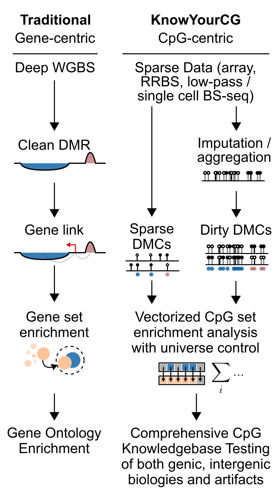

KnowYourCG (KYCG) is a supervised learning framework designed for the functional 
analysis of DNA methylation data. Unlike existing tools that focus on genes or 
genomic intervals, KnowYourCG directly targets CpG dinucleotides, featuring 
automated supervised screenings of diverse biological and technical influences, 
including sequence motifs, transcription factor binding, histone modifications, 
replication timing, cell-type-specific methylation, and trait associations. 
KnowYourCG addresses the challenges of data sparsity in various methylation 
datasets, including low-pass Nanopore sequencing, single-cell DNA methylomes, 
5-hydroxymethylation profiles, spatial DNA methylation maps, and array-based 
datasets for epigenome-wide association studies and epigenetic clocks.

The input to KYCG is a CpG set (query). The CpG sets can represent differential
methylation, results from an epigenome-wide association studies, or any sets
that may be derived from analysis. If analyzing **sequencing data**, the
preferred format is a YAME-compressed binary vector of 0 and 1 to indicate
whether the CpG is in set. This format assume a specific order of CpGs
following the genomic coordinates. Since it's a coordinate-free approach, the
reference coordinate is critical. Please refer to the YAME documentation for
details.  https://zhou-lab.github.io/YAME/.



# PREPARATION

1. A bed file containing the output significant coordinates from differential
   analysis
2. Installed
   [bedtools](https://bedtools.readthedocs.io/en/latest/content/installation.html)
   on your system
3. A reference coordinate bed file (We have provided hg38 and mm10 CpG
   reference coordinate annotations .cr on KYCG github)
   [mm10](https://github.com/zhou-lab/KYCGKB_mm10)/[hg38](https://github.com/zhou-lab/KYCGKB_hg38).

```bash
yame unpack cpg_nocontig.cr | gzip > cpg_nocontig.bed.gz
```

First, we will pack the bedfile into a .cg format. If the input bedfile is
already sorted, you can start with the intersect step. Check out the [bedtools
instersect help
page](https://bedtools.readthedocs.io/en/latest/content/tools/intersect.html)
if you encounter any problems at this step.

```bash

bedtools sort -i yourfile.bed | bedtools intersect -a cpg_nocontig.bed.gz -b -
-sorted -c | cut -f4 | yame pack -fb - > yourfile.cg

```

# QUICK START

```{r seq1, fig.width=5, fig.height=5, message=FALSE}
library(knowYourCG)

# Download query and knowledgebase datasets:
temp_dir <- tempdir()
knowledgebase <- file.path(temp_dir, "ChromHMM.20220414.cm")
query <- file.path(temp_dir, "single_cell_10_samples.cg")
knowledgebase_url <- "https://github.com/zhou-lab/KYCGKB_mm10/raw/refs/heads/main/ChromHMM.20220414.cm"
query_url <- "https://github.com/zhou-lab/YAME/raw/refs/heads/main/test/input/single_cell_10_samples.cg"
download.file(knowledgebase_url, destfile = knowledgebase)
download.file(query_url, destfile = query)

# test enrichment
res = testEnrichment(query, knowledgebase)
KYCG_plotDot(res)
```


# KNOWLEDGEBASES

Whole-genome and array knowledgebases are available as listed in the following tables.

| Assembly | Link |
|----------|----------|
| mm10  | https://github.com/zhou-lab/KYCGKB_mm10  |
| hg38  | https://github.com/zhou-lab/KYCGKB_hg38  |
| HM450  | https://github.com/zhou-lab/KYCG_knowledgebase_HM450  |
| EPIC  | https://github.com/zhou-lab/KYCG_knowledgebase_EPIC  |
| MSA  | https://github.com/zhou-lab/KYCG_knowledgebase_MSA  |


# ENRICHMENT TESTING

Then we simply run [`yame summary`]() with
`-m` feature file for enrichment testing. We have provided comprehensive
enrichment feature files, and you can download them from th KYCG github page
[mm10](https://github.com/zhou-lab/KYCGKB_mm10)/[hg38](https://github.com/zhou-lab/KYCGKB_hg38). You
can also create your own feature file with [`yame pack`]().

```bash
yame summary -m feature.cm yourfile.cg > yourfile.txt
```

Detailed information of the output columns can be found on the [`yame
summary`]() page. Basically, a higher
log2oddsratio indicates a stronger association between the feature being tested
and the query set. Generally, a large log2 odds ratio is typically considered
to be around 2 or greater, with values between 1 and 2 often being viewed as
potentially important and worthy of further investigation, while values around
0.5 might be considered a small effect size. For significance testing,
[seasame](https://www.bioconductor.org/packages/release/bioc/html/sesame.html)
R package provided the testEnrichmentFisherN function, which is also provided
in the yame github R page. The four input parameters correspond to the four
columns from yame summary output.

```
ND = N_mask
NQ = N_query
NDQ = N_overlap
NU = N_universe
```

We can create a coarse differential methylation datasets the following way

```bash
yame pairwise -H 1 -c 10 sample1.cg sample2.cg -o output.cg
```

-H controls directionality and -c controls minimum coverage. 

The output is a query CG sets with proper universe background.  Selecting the
appropriate background for enrichment testing is crucial because it can
significantly impact the interpretation of the results. Usually, we use the
background set that is measured in the experiment under different conditions.

```bash
yame mask -c query.cg universe.cg | yame summary -m feature.cm - > yourfile.txt
```

The following is an analysis example in R that explicitly call `yame` in R.

```R

df = tibble(read.table(text=system("yame summary -m ~/references/mm10/KYCGKB_mm10/stranded/kmer10.20231201.cm /mnt/isilon/zhou_lab/projects/20230727_all_public_WGBS/mm10_stranded/20231201_neuron_MeCP2.cg", intern=TRUE), head=T))

```

# SESSION INFO

```{r}
sessionInfo()
```
